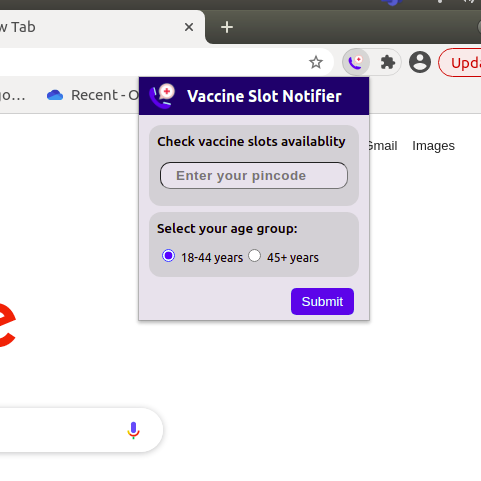
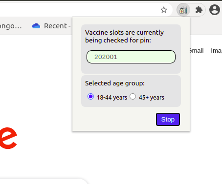

# CoWin Vaccine Slot Notifier

It is a chrome extension which can simplify your vaccine slot hunt, and notify you via desktop notifications (and a ringtone ..tada :stuck_out_tongue:) once they are available.

## Features
 * Search vaccines by your pin code.
 * Get desktop notifications when vaccines slots are available
 * Get updated data for slots every 1-minute.
 

## Installation

Open your chrome extensions page from chrome://extensions/  
You can open it alternatively by going to Chrome settings -> More Tools -> Extensions

On the right top corner turn on the developer mode (yayy :grin:)

Out of three tabs displayed in the bottom tray , click Load unpacked.

Now choose your destination path of SlotNotifier repository.

That's it.!! :clap:

You have installed the extension and you should be able to see it in your extensions page.

(Note: Since this is an unpublished extension , it can be used only in developer mode. Try it on your own risk)

## Usage

Open the extension.  In the pop up box you can put the pin code of the area for which you wish to check the slots.
Click on Submit.

The script for checking the slots has been triggered. It will keep on running in background checking the slots ..while you can continue sipping your coffee :P

You will get notifications when slots in your area are available.

You can open the extension anytime and check the current pincode for which slots are being checked. Also, you have the option to stop the script anytime you wish.

---
**NOTE**

This extension is made solely for the puprpose of learning & the author does **not** endorse in any form automating monitoring task.The author should not be held responsible for any legal issue if ever. Please use it at your own risk. 

---

