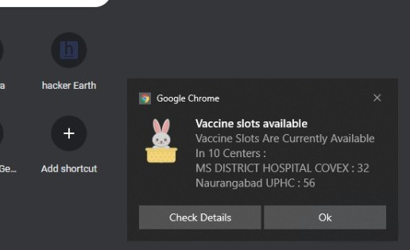
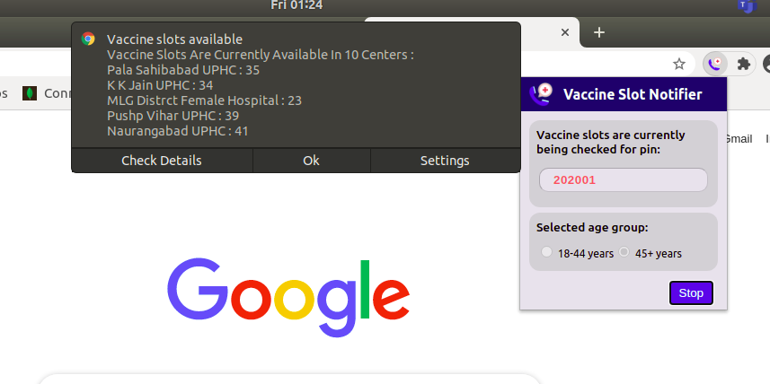

# CoWin Vaccine Slot Notifier

It is a chrome extension which can simplify your vaccine slot hunt, and notify you via desktop notifications (and a ringtone ..tada :stuck_out_tongue:) once they are available.

## Features
 * Search vaccines by your pin code.
 * Get desktop notifications when vaccines slots are available
 * Get updated data for slots every 1-minute.
 * Find vaccines even after shutting down your chrome, once extension has been set to check.
 

## Installation

Download the code as .zip file from the latest release and extract into your folder.

Open your chrome extensions page from chrome://extensions/  
You can open it alternatively by going to Chrome settings -> More Tools -> Extensions

On the right top corner turn on the developer mode (yayy :grin:)

Out of three tabs displayed in the bottom tray , click Load unpacked.

Now choose your destination path as the folder where you have cloned/downloaded the SlotNotifier repository.

That's it.!! :clap:

You have installed the extension and you should be able to see it in your extensions page.

(Note: Since this is an unpublished extension , it can be used only in developer mode. Try it on your own risk)

## Usage

Open the extension.  In the pop up box you can put the pin code of the area for which you wish to check the slots.
Click on Submit.  


The script for checking the slots has been triggered. It will keep on running in background checking the slots ..while you can continue sipping your coffee :stuck_out_tongue:


You will get notifications when slots in your area are available.

You can open the extension anytime and check the current pincode for which slots are being checked. Also, you have the option to stop the script anytime you wish.

These are desktop notifications,so even when you are using other apps on your system,you will receive them.If you are using Windows, you can also access them from your system tray.

### Notifications In Windows



### Notifications In Linux


***Feel free to clone/download and use it.If you like it, please star mark the repository as it motivates us to do better everyday.***

## Technical Details
Now as I have your attention, since you have scrolled this far..I assume you would be interested in knowing how this extension written in Javscript works.
For the people already familiar with the development of chrome extension & chrome apis ..thats not hard to figure out. For the newbies I can explain in detail.
Since this is a chrome extension , I have exploited few APIs provided by chrome for serving our purpose. 
### Storage Api
Since we needed to store the user information so that the background script can keep on picking that data.Also, when user opens the extension to check the running status, we needed to show the previously entered information.We have utilised the chrome local storage for this. Chrome provides an api to store and retreive data on local storage.They can be used in the following manner:
```javscipt 
 chrome.storage.local.set({ 'userData': data }, () => {
        if (chrome.runtime.lastError)
            console.log('Error setting');
        console.log('Stored name: ' , data);
    });
```
### Alarms Api
The alarms api is at the heart of the background running script. The prime requirement was to have the slot checking script triggered every once in a while.With async await this could have been done but only till the user kept the extension open. 
Other alternative was to mark the background script as persistent. Marking a script persitent means the script would keep on running in the background forever consuming resources all the time.It is generally not advised to use a persistent background script.
The alarms api can set trigger for your background script. You can add an event handler that can handle the alarm event, and further process your background task.
```
 chrome.alarms.create('vaccineSlots', { periodInMinutes: 1 });
```

```
 chrome.alarms.onAlarm.addListener((alarm) => {
    if(alarm.name === 'vaccineSlots') {
        getUserDataFromLocalStorage().then((data)=> {
            if(data) {
                getVaccineSlots(data);
            } else {
                console.log('No pin code saved');
            }
        });
    }  
});
```
---
**NOTE**

This extension is made solely for the puprpose of learning & the author does **not** endorse in any form automating monitoring task.The author should not be held responsible for any legal issue if ever. Please use it at your own risk. 

---

